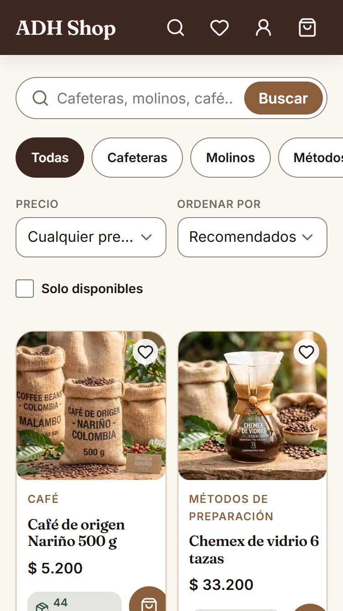
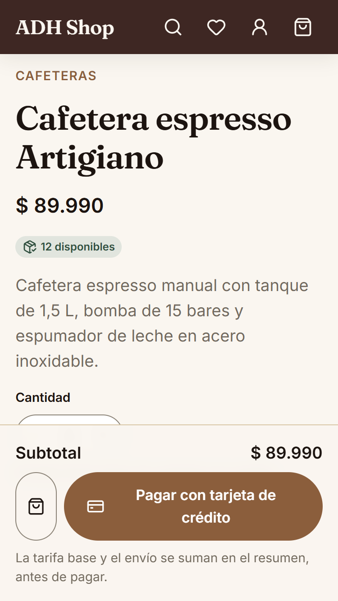
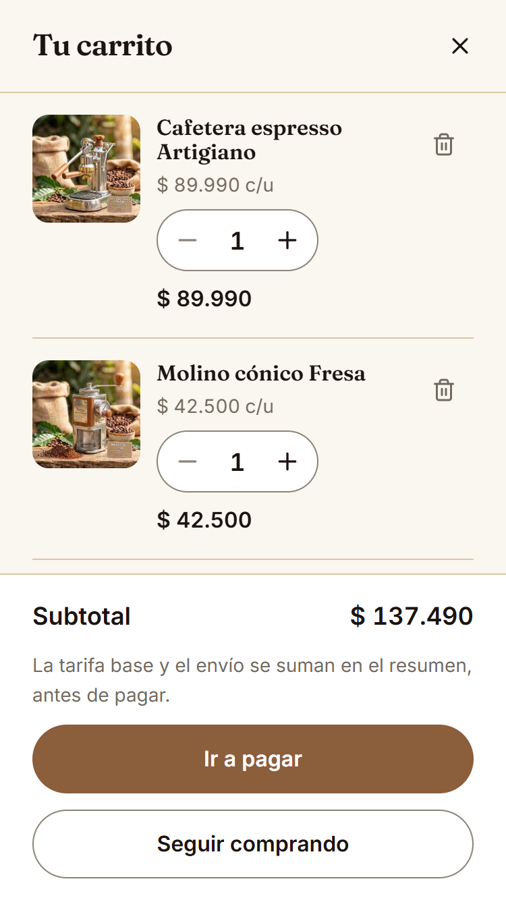
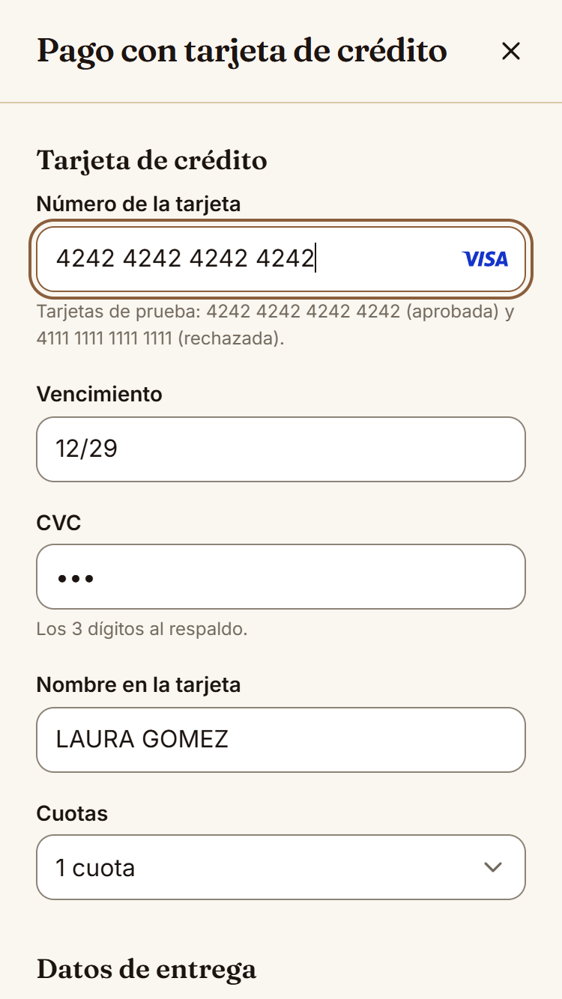
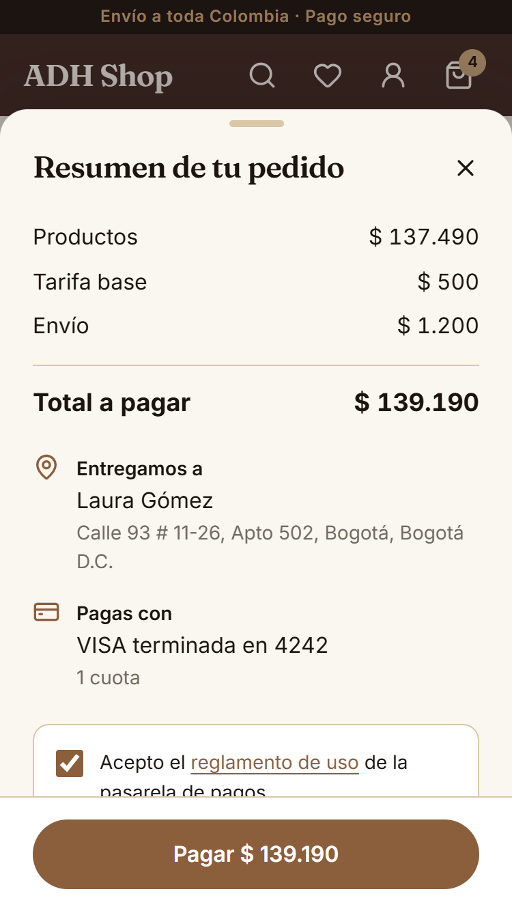
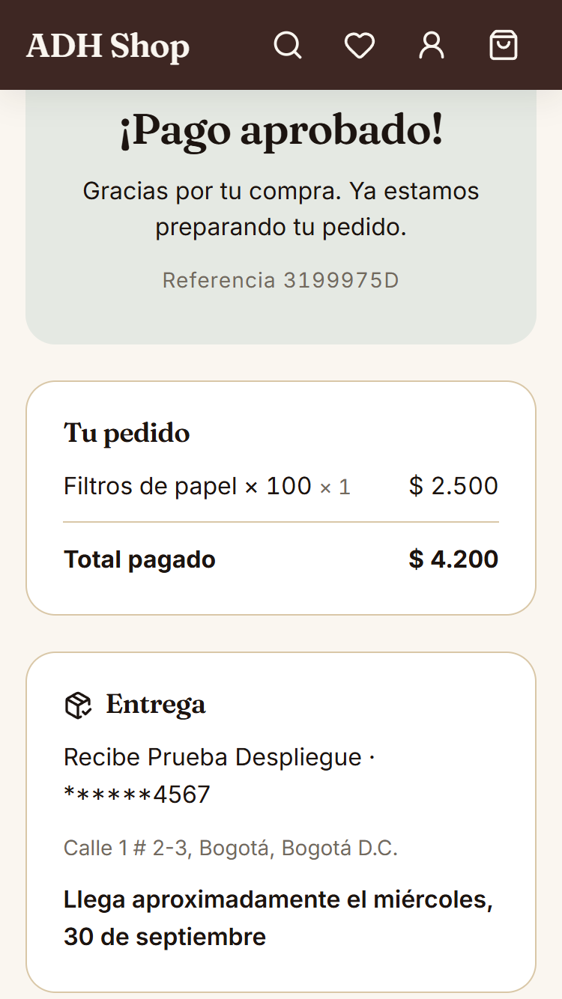
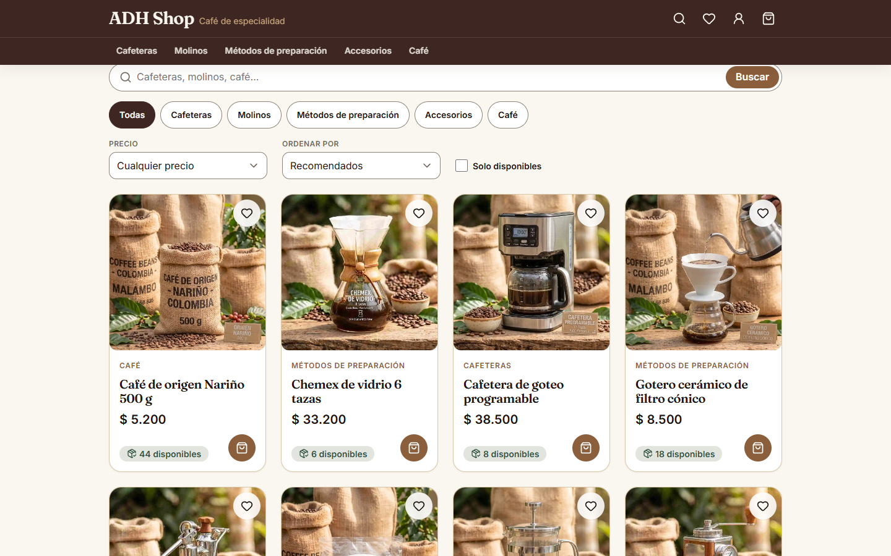
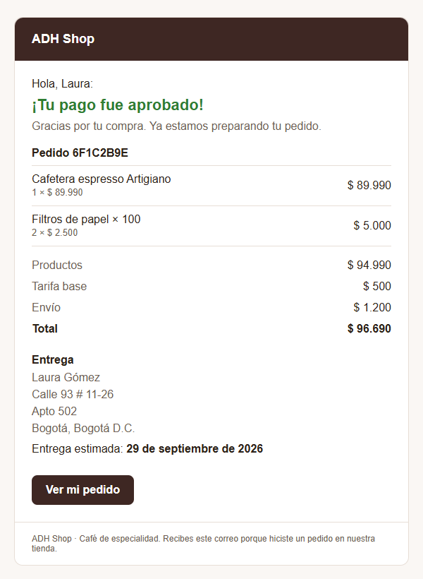

# ADH Shop — Storefront

Mobile-first single-page storefront for ADH Shop, a specialty coffee store: browse the
catalogue, pay by card through a payment gateway (sandbox), and follow the order to
delivery. Built with React, Redux Toolkit and RTK Query, backed by the
[ADH Shop API](https://github.com/alfredo0607/adh-shop-api) and deployed to AWS.

| Resource       | URL                                                                         |
| -------------- | --------------------------------------------------------------------------- |
| **Storefront** | **https://adh-shop.alfredo-dominguez.dev**                                  |
| API            | `https://adh-api.alfredo-dominguez.dev/api/v1`                              |
| API docs       | https://adh-api.alfredo-dominguez.dev/api/docs                              |
| API repository | [adh-shop-api](https://github.com/alfredo0607/adh-shop-api) (NestJS)        |
| Infrastructure | [adh-shop-infra](https://github.com/alfredo0607/adh-shop-infra) (Terraform) |

> [!TIP]
> **Test cards (sandbox):** `4242 4242 4242 4242` is approved and `4111 1111 1111 1111` is
> declined. Any future expiry date, any 3-digit CVC and any name. No real money moves.

---

## Screenshots

On an iPhone SE (375 × 667), the brief's reference device:

| Catalogue                                                   | Product                                              | Cart                                              |
| ----------------------------------------------------------- | ---------------------------------------------------- | ------------------------------------------------- |
|          |  |          |
| **Card and delivery**                                       | **Summary**                                          | **Final status**                                  |
|  |       |  |

On a desktop, and the email the buyer receives once the payment is final:

| Desktop                                                      | Payment email                                         |
| ------------------------------------------------------------ | ----------------------------------------------------- |
|  |  |

---

## Contents

0. [Exercise checklist](#exercise-checklist)
1. [The purchase flow](#the-purchase-flow)
2. [Architecture](#architecture)
3. [Tests and coverage](#tests-and-coverage)
4. [Security](#security)
5. [Performance and accessibility](#performance-and-accessibility)
6. [Getting started](#getting-started)
7. [Configuration](#configuration)
8. [Deployment](#deployment)
9. [Pull request checks](#pull-request-checks)
10. [Engineering documentation](#engineering-documentation)

---

## Exercise checklist

Every point the exercise asks of the frontend, and where it is met. The rules the API
enforces behind these screens are in the
[API's checklist](https://github.com/alfredo0607/adh-shop-api#exercise-checklist).

### Business process

| #   | The exercise asks                                               | Status | How                                                                                                                                                       |
| --- | --------------------------------------------------------------- | :----: | --------------------------------------------------------------------------------------------------------------------------------------------------------- |
| 1   | Product page with stock, description and price                  |   ✅   | Catalogue and product page read live stock; units offered are capped by stock and by the order limit. Categories, search, filters and numbered pagination |
| 2   | "Pay with credit card" opens a modal for card and delivery data |   ✅   | `/checkout`: one form, card first, then delivery. Also reached from the cart ("Ir a pagar") for an order of several products                              |
| 2.1 | Detect VISA and Mastercard, show the logo                       |   ✅   | The brand logo appears from the first identifying digits (BIN ranges), inside the number field                                                            |
| 2.2 | Fake card data, but following the structure of real cards       |   ✅   | Luhn check, brand ranges, future expiry, 3-digit CVC, holder name; each field reports its first failing rule and focus moves to the first error           |
| 3   | Summary in a backdrop: product amount, base fee, delivery fee   |   ✅   | `/checkout/resumen`: a bottom sheet with the amounts quoted by the API, the delivery address, the card's brand and last four, and the gateway's terms     |
| 4   | Pay: create the transaction, then pay through the gateway       |   ✅   | "Pagar" creates the PENDING transaction, tokenises the card with the gateway in the browser, and pays with an idempotency key. A double tap does nothing  |
| 5   | Final status of the payment                                     |   ✅   | `/orders/{id}` polls every 2 s until the outcome is final: approved (with the delivery), declined, voided or error                                        |
| 6   | Back to the product page, with the stock updated                |   ✅   | "Volver a la tienda" closes the order; the products bought are refetched, so the stock shown is the new one                                               |

### Technical requirements

| The exercise asks                                        | Status | How                                                                                                                                           |
| -------------------------------------------------------- | :----: | --------------------------------------------------------------------------------------------------------------------------------------------- |
| Single-page application in ReactJS                       |   ✅   | React 19, React Router data router; no other application framework                                                                            |
| Redux, following Flux                                    |   ✅   | Redux Toolkit slices for the order and the cart; RTK Query for server data, generated from the API's OpenAPI document                         |
| Mobile first, iPhone SE (2020) as the smallest reference |   ✅   | Designed at 375 px, verified down to 320 px with no horizontal scroll; wider layouts from 600 px and 960 px                                   |
| Resilient to a page refresh, storing progress securely   |   ✅   | The order and the cart are persisted and validated when read back; card data never is. A reload during a payment resumes on its status screen |
| Flexbox or grid, any CSS approach                        |   ✅   | CSS Modules on design tokens, flexbox and grid; no CSS framework. Radix Primitives brings behaviour only                                      |
| Unit tests with Jest, coverage above 80%                 |   ✅   | 294 tests; **98.3% statements, 93.2% branches** ([details](#tests-and-coverage)); CI fails below 80%                                          |
| Deployed to the cloud                                    |   ✅   | S3 and CloudFront on AWS, with its own certificate and Content-Security-Policy, released on every merge to `main`                             |
| README with the coverage results                         |   ✅   | This file                                                                                                                                     |

Beyond the brief: a cart of up to 10 different products paid in one order, favourites and
account icons (visual only), an email to the buyer when the payment is approved or refused,
and a documented [technical audit](docs/audits/2026-09-26-frontend-audit.md) whose
findings were fixed before deployment.

## The purchase flow

The five screens of the brief, as routes:

| Screen              | Route                 | What happens                                                                               |
| ------------------- | --------------------- | ------------------------------------------------------------------------------------------ |
| Product (catalogue) | `/`, `/products/{id}` | Live stock and prices; add to the cart or buy now                                          |
| Card and delivery   | `/checkout`           | The card stays in this route's memory; delivery details are saved to resume after a reload |
| Summary             | `/checkout/resumen`   | `GET /quotes` prices the order on the server; the buyer accepts the gateway's terms        |
| Payment             | —                     | `POST /transactions` → card tokenised by the gateway → `POST /transactions/{id}/payment`   |
| Final status        | `/orders/{id}`        | Polls `GET /transactions/{id}` until final; shows the delivery when approved               |

The API sends the buyer an email with the outcome, the products, the amounts and the
delivery address, through a queue and a Lambda (see
[adh-shop-infra](https://github.com/alfredo0607/adh-shop-infra#payment-emails)).

The full sequence, the reload rules and every error case are in
[checkout-flow.md](docs/guide/checkout-flow.md).

## Architecture

```
src/
├── app/         Composition root: store, persistence, router, layout, error screens
├── api/         RTK Query endpoints generated from the API's OpenAPI snapshot; card tokenisation
├── features/
│   ├── catalog/     Home, catalogue with filters in the URL, product page
│   ├── cart/        Persisted cart, side panel, live prices and stock
│   ├── checkout/    Card and delivery form, summary, payOrder, the order slice
│   └── orders/      Status screen with polling
└── shared/      UI kit (wrapping Radix), errors, es-CO copy, money, design tokens
```

- **Three homes for state.** Server data in the RTK Query cache; the order and the cart in
  Redux, persisted; forms in component state. Filters and the page number live in the URL.
- **The card never enters Redux or storage.** It lives in the `/checkout` route's React
  state and is handed to `payOrder` as a function argument, never as an action. The gateway
  turns it into a single-use token in the browser; the API only ever sees the token.
- **One error pipeline.** Every failure becomes an `AppError`; expected ones are explained
  where they happen, unexpected ones raise a notice, crashes land on an error screen.
- **Boundaries enforced by lint.** `shared/` cannot import features; Radix is used only
  inside `shared/ui`.

Details and the reasons for each choice: [architecture.md](docs/guide/architecture.md),
[state.md](docs/guide/state.md).

## Tests and coverage

```bash
pnpm test:cov
```

| Metric     |   Coverage |     Covered |
| ---------- | ---------: | ----------: |
| Statements | **98.31%** | 1284 / 1306 |
| Branches   | **93.15%** |   653 / 701 |
| Functions  | **97.87%** |   277 / 283 |
| Lines      | **99.45%** | 1087 / 1093 |

**294 tests in 19 suites**, all passing. The 80% threshold lives in `jest.config.js`, so
the run fails on its own if coverage drops, and every pull request shows this table in its
job summary.

- **Jest, React Testing Library and MSW.** Screens are tested as a buyer uses them, by
  role and accessible name, against a mocked API at the network level.
- **What is covered:** the card and delivery rules, the order and cart slices and their
  rehydration, the whole purchase from the product to the outcome, every API error code,
  double taps, lost connections, reloads mid-payment, and that no card data reaches the
  store or storage.

See [testing.md](docs/guide/testing.md).

## Security

- **Card data** never touches Redux, `localStorage` or this project's API: it goes from the
  form straight to the gateway's tokenisation endpoint.
- **Content-Security-Policy** at the edge: scripts only from the site itself; network calls
  only to the API and the gateway; images only from the site and the image CDN.
- **HSTS, `nosniff`, `X-Frame-Options: DENY`, Referrer-Policy, Permissions-Policy** on every
  response.
- **Stored state is validated** before it is trusted; a malformed record starts a fresh order.
- **Payments are idempotent** and a second tap never opens a second transaction.

See [security.md](docs/guide/security.md).

## Performance and accessibility

| Chunk   |     Size |    gzip | Contents                              |
| ------- | -------: | ------: | ------------------------------------- |
| `react` | 315.6 KB | 99.5 KB | React, React DOM, React Router        |
| `index` | 203.1 KB | 63.5 KB | The application                       |
| `state` |  89.8 KB | 30.2 KB | Redux Toolkit, RTK Query, persistence |
| `ui`    |  65.0 KB | 21.8 KB | Radix Primitives, icons               |
| CSS     |  43.7 KB |  8.3 KB | Every screen                          |

- Vendor code is split from the app, so a release re-downloads only what changed. Hashed
  bundles are cached for a year; `index.html` is always revalidated.
- Fonts are self-hosted; images have fixed dimensions (no layout shift), load lazily below
  the fold, and fall back to a placeholder.
- Accessible by construction: labelled controls with errors announced, a skip link, focus
  managed in dialogs, stock shown with words and icons rather than colour alone, and a
  palette checked against WCAG AA ([palette.md](docs/guide/palette.md)).

## Getting started

Requirements: Node 24 and pnpm.

```bash
pnpm install
pnpm dev            # http://localhost:5173, with /api proxied to the ADH Shop API
```

| Command             | What it does                                                                                          |
| ------------------- | ----------------------------------------------------------------------------------------------------- |
| `pnpm dev`          | Development server with hot reload                                                                    |
| `pnpm build`        | Typecheck, then the production bundle in `dist/`                                                      |
| `pnpm preview`      | Serves the production bundle locally                                                                  |
| `pnpm check`        | Every CI gate in order: formatting, lint, types, tests with coverage, build                           |
| `pnpm lint`         | ESLint, with type-aware rules, accessibility and import boundaries; `lint:fix` applies the safe fixes |
| `pnpm typecheck`    | TypeScript, no output                                                                                 |
| `pnpm format`       | Prettier over the repository; `format:check` only reports, as CI does                                 |
| `pnpm test`         | Jest; `test:watch` reruns on change                                                                   |
| `pnpm test:cov`     | Jest with coverage; fails below 80%                                                                   |
| `pnpm api:schema`   | Downloads the API's OpenAPI document into `src/api/openapi.json`                                      |
| `pnpm api:generate` | Regenerates the RTK Query endpoints and types from that snapshot                                      |

## Configuration

| Variable            | Local                                                  | Production                              |
| ------------------- | ------------------------------------------------------ | --------------------------------------- |
| `VITE_API_BASE_URL` | empty: same origin, and Vite proxies `/api` to the API | `https://adh-api.alfredo-dominguez.dev` |

Nothing else is configured at build time: the gateway's public key and tokenisation URL
come from the API at runtime.

## Deployment

A static build in a private S3 bucket, served by its own CloudFront distribution with an
ACM certificate, provisioned in [adh-shop-infra](https://github.com/alfredo0607/adh-shop-infra).
Every merge to `main` runs the CI checks again on the merged commit, builds, uploads the
hashed bundles before `index.html`, and invalidates the edge cache. GitHub assumes a role
through OIDC that can only write that bucket and invalidate that distribution: no AWS key
is stored anywhere. See [deployment.md](docs/guide/deployment.md).

## Pull request checks

Every pull request to `main` runs, and must pass:

1. Formatting (Prettier)
2. Lint (ESLint)
3. Typecheck (TypeScript)
4. Tests with coverage, gated at 80% as the brief requires
5. Production build
6. Dependency audit (high severity and above)

## Engineering documentation

- [`docs/guide/`](docs/guide/README.md): the plan, the architecture and the rules this
  codebase follows, each with its reason.
- [`docs/audits/`](docs/audits/README.md): the technical audit run before deployment, and
  its findings.
