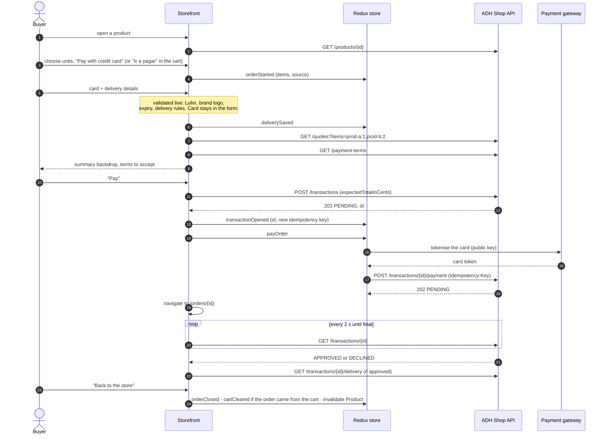

# Checkout flow

The brief defines five screens: **product → card and delivery → summary → final status →
product**. This is how each maps to routes, state and API calls.

## Routes

| Route                   | Screen                                                                    | Brief step |
| ----------------------- | ------------------------------------------------------------------------- | ---------- |
| `/`                     | Catalogue: search, filters, sorting and pages, all in the query string    | 1          |
| `/products/:id`         | Product page: description, price, stock, units, "Pay with credit card"    | 1          |
| `/checkout`             | Card and delivery form, in a modal; reached from "buy now" or the cart    | 2          |
| `/checkout/resumen`     | Summary in a backdrop: product amount, base fee, delivery fee, terms      | 3          |
| `/orders/:id`           | Final status: approved with delivery details, or declined with a way back | 4          |
| back to `/products/:id` | Product page again, with the stock refetched                              | 5          |

## Sequence

The transaction is created when the buyer presses **Pay**, not earlier, as the brief
specifies. Creating it on the summary screen would reserve stock for buyers who are only
looking.

## Resuming after a reload

On start, after redux-remember rehydrates `checkout`, the app routes by what is stored:

| Stored state                                       | Goes to                                        | Why                                                                                                     |
| -------------------------------------------------- | ---------------------------------------------- | ------------------------------------------------------------------------------------------------------- |
| `paymentStatus = submitted`                        | `/orders/{transactionId}` and resumes polling  | The payment is in flight or done; the server knows the outcome                                          |
| `paymentStatus = submitting`                       | `/orders/{transactionId}`                      | The request may or may not have arrived; polling finds out, and a retry reuses the same idempotency key |
| A transaction, no payment, reservation still valid | `/checkout/resumen`, asking for the card again | Card data is never stored                                                                               |
| A transaction whose reservation expired            | Product page, with a notice                    | The units went back to stock; start again                                                               |
| Items and delivery, no transaction                 | `/checkout/resumen`                            | Nothing reserved yet                                                                                    |
| Nothing                                            | `/`                                            |                                                                                                         |

The transaction response carries `paymentSubmitted` and `reservationExpiresAt`, which is
everything this decision needs.

## Errors

The UI branches on the API's `error.code`, never on its message. How errors are normalised,
translated into the es-CO copy and presented is defined in [errors.md](./errors.md). This table
is what each one means for the flow.

| Code                                 | Where         | What the buyer sees and can do                                            |
| ------------------------------------ | ------------- | ------------------------------------------------------------------------- |
| `INSUFFICIENT_STOCK`                 | quote, create | "Solo quedan N unidades", with units capped to what is available          |
| `AMOUNT_MISMATCH`                    | create        | "El total cambió", with the summary refreshed to the new total            |
| `RESERVATION_EXPIRED`                | pay           | "Tu reserva expiró", and the order starts again                           |
| `PAYMENT_REJECTED`                   | pay           | "No pudimos procesar la tarjeta", back to the card form                   |
| `TRANSACTION_NOT_PAYABLE`            | pay           | Goes to the status screen: a payment already exists                       |
| `INVALID_*` (422)                    | create        | The field is highlighted in the form                                      |
| `PAYMENT_GATEWAY_UNAVAILABLE`, `503` | any           | "El servicio de pagos no responde", with a retry that reuses the same key |
| `429 RATE_LIMITED`                   | any           | "Demasiados intentos", with the retry delay from `Retry-After`            |
| Network failure                      | any           | "Sin conexión"; nothing is resubmitted automatically                      |

## Final status

| Status                          | Screen                                                                           |
| ------------------------------- | -------------------------------------------------------------------------------- |
| `APPROVED`                      | Confirmation, amount paid, delivery address, estimated date (from the delivery)  |
| `DECLINED`, `VOIDED`, `ERROR`   | What happened, nothing was charged, "Try another card", which starts a new order |
| `EXPIRED`                       | The reservation ran out before payment                                           |
| Still `PENDING` after 2 minutes | "Still processing", with a manual refresh; the order is safe to leave            |

## Card form rules

| Field        | Rule                                                                                                                                                                       |
| ------------ | -------------------------------------------------------------------------------------------------------------------------------------------------------------------------- |
| Number       | Digits only, spaced in groups of four as typed; **Luhn** check; brand from the BIN: VISA `4`, Mastercard `51–55` and `2221–2720`; logo shown as soon as the brand is known |
| Expiry       | `MM/YY`, month 01–12, not in the past                                                                                                                                      |
| CVC          | 3 digits (4 reserved for brands that use it)                                                                                                                               |
| Holder       | 5–60 characters, letters and spaces                                                                                                                                        |
| Installments | 1–36, default 1                                                                                                                                                            |

Card data is test data that follows the structure of real cards, as the brief requires. The
sandbox documents numbers that are approved (`4242 4242 4242 4242`) and declined
(`4111 1111 1111 1111`).
